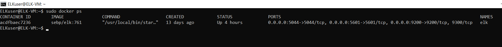
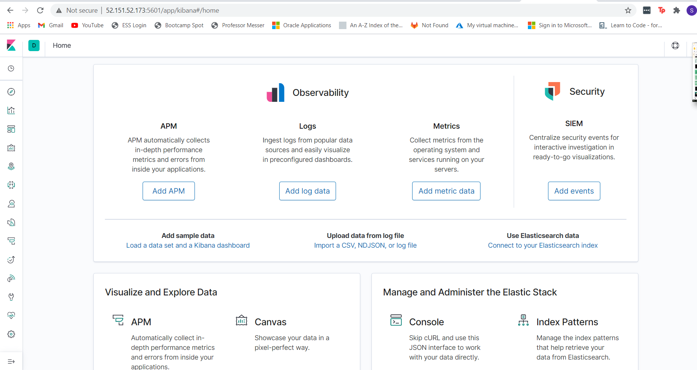

# UTOR-Cyber-Security-Project-1
## Automated ELK Stack Deployment

The files in this repository were used to configure the network depicted below.

These files have been tested and used to generate a live ELK deployment on Azure. They can be used to either recreate the entire deployment pictured above. Alternatively, select portions of the YAML files may be used to install only certain pieces of it, such as Filebeat.

This document contains the following details:
- Description of the Topology
- Access Policies
- ELK Configuration
  - Beats in Use
  - Machines Being Monitored
- How to Use the Ansible Build

### Description of the Topology

The main purpose of this network is to expose a load-balanced and monitored instance of DVWA, the D*mn Vulnerable Web Application.

Load balancing ensures that the application will be highly secure, in addition to restricting traffic to the network.

Integrating an ELK server allows users to easily monitor the vulnerable VMs for changes to the log data and system metrics.

The configuration details of each machine may be found below.

| Name     | Function | IP Address | Operating System |
|----------|----------|------------|------------------|
| Jump Box | Gateway  | 10.0.0.4   | Linux            |
| Web-1    | DVWA/ELK | 10.0.0.5   | Linux            |
| Web-2    | DVWA/ELK | 10.0.0.6   | Linux            |
| ELK VM   | Kibana   | 10.1.0.5   | Linux            |

### Access Policies

The machines on the internal network are not exposed to the public Internet. 

Only the Jump Box machine can accept connections from the Internet. Access to this machine is only allowed from the following IP addresses:
- 99.251.128.224

Machines within the network can only be accessed by Jump Box - 10.0.0.4

A summary of the access policies in place can be found in the table below.

| Name     | Publicly Accessible | Allowed IP Addresses    |
|----------|---------------------|----------------------   |
| Jump Box | Yes                 | 99.251.128.224          |
| Web-1    | No                  | 10.0.0.4, 10.1.0.5      |
| Web-2    | No                  | 10.0.0.4, 10.1.0.5      |
| ELK VM   | Yes                 | 10.0.0.4,99.251.128.224 |

### Elk Configuration

Ansible was used to automate configuration of the ELK machine. No configuration was performed manually, which is advantageous because it confirms the configuration was done without error. Once the playbook is complete without error, it deploying the playbook for future machines very effortless, with only a few changes needed to configuration files. 

The playbook implements the following tasks:
- Installs Docker and Python3-pip as the default docker modules
- Increases virtual memory to a value of "262144"
- launches the elk image (sebp/elk:761) to the desired container
- Confirm the ports that ELK uses to run (5601,9200,5044)
- Allows the docker sercice to be enabld upon boot

The following screenshot displays the result of running `docker ps` after successfully configuring the ELK instance.

### Target Machines & Beats
This ELK server is configured to monitor the following machines:
- 10.0.0.5
- 10.0.0.6

We have installed the following Beats on these machines:
- filebeat
- metricbeat

These Beats allow us to collect the following information from each machine:
- Filebeat monitors log files on specified machines such as log events, visitor traffic, etc. It then forwards the data to easily viewable interfaces such as elasticsearch (kibana).
- Metricbeat monitors aspects of computer system performance for specified machines. This includes CPU and memory usage. It also forwards the data to applications such as elasticsearch.

### Using the Playbook
In order to use the playbook, you will need to have an Ansible control node already configured. Assuming you have such a control node provisioned: 

SSH into the control node and follow the steps below:
- Copy the filebeat-playbook.yml and metricbeat-playbook.ym file to the ~/etc/ansible directory.
- Update the hosts file to include your machine's IP address. You will also update the playbook files in accordance with the hosts file to specify which machine to install each playbook on
- Run the playbook, and navigate to the VM which ELK is deployed on to check that the installation worked as expected. You will also navigate to the following URL using the IP of which ELK is deployed, under port 5601: http://[your.ELK-VM.External.IP]:5601/app/kibana (set an inbound security rule on your network security group to allow access to port 5601 from your personal IP)

### Step-by-Step Configuration

First, you will need to update the following configuration files to your specifications:
- nano ansible.cfg
- nano metricbeat-config.yml
- nano filebeat-config.yml

You will then update the hosts file to include your private IP address for your specific machine
- nano hosts

Then, run the pentest playbook to run your docker containers for Web-1 and Web-2 VMs
- ansible-playbook pentest.yml

Run the filebeat and metricbeat playbooks so that both services are running on your ELK-VM
- ansible-playbook filebeat-playbook.yml
- ansible-playbook metricbeat-playbook.yml

Once the above commands are configured, SSH into your ELK-VM and run the following command to confirm the ELK container is running 
- sudo docker ps

After confirming that the ELK container is up and running, and setting your inbound security rule for port 5601 as mentioned above, navigate to the following url: http://[your.ELK-VM.External.IP]:5601/app/kibana 

If configured correctly, the url should produce this screen: 

 